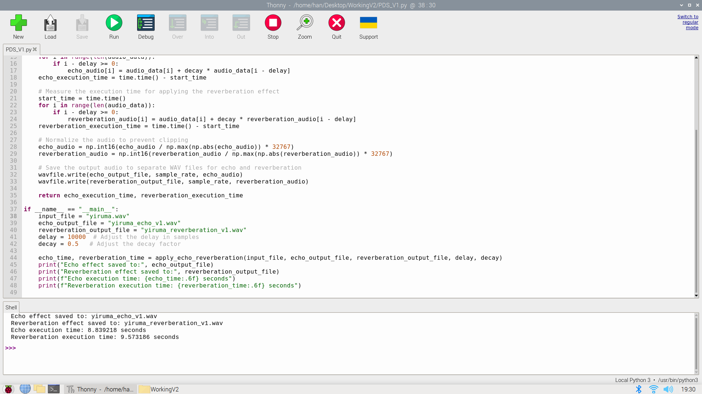
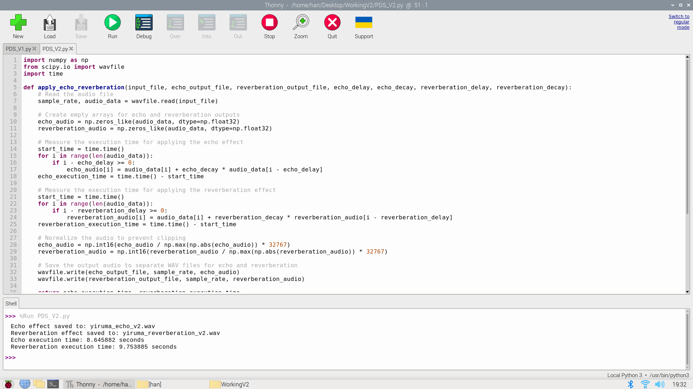
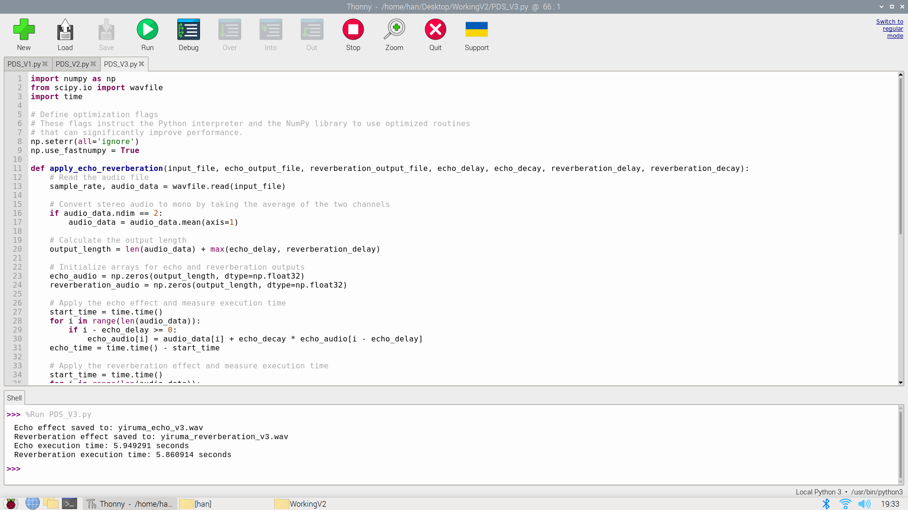
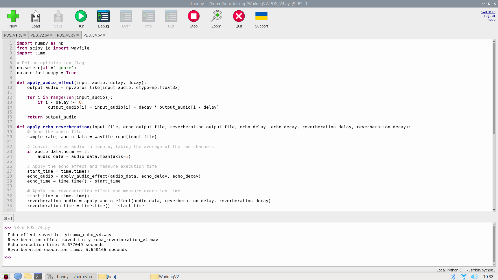

## Dezvoltarea unui algoritm optimizat pe extensia DSP din Raspberry Pi pentru implementarea efectelor ecou și reverberație pe un fișier audio conținând voce

### Autori:

- Adam Iulian-Valentin
- Handaric Andrei

### Descriere proiect:

În implementarea acestui proiect, am dezvoltat un algoritm care prelucrează efectele de ecou și reverberație pe un fișier audio. Acest algoritm a fost optimizat în mai multe versiuni, până am obținut varianta cea mai eficientă din punct de vedere a timpului de execuție, varianta 4 sau finală. Pentru a compara peformanța algoritmului am analizat timpii de execuție pentru implementarea celor două efecte.

### Fișiere audio:

Pentru testarea algoritmului, am utilizat un sample din melodia Yiruma - River flows in you.

### Simularea timpului de execuție

